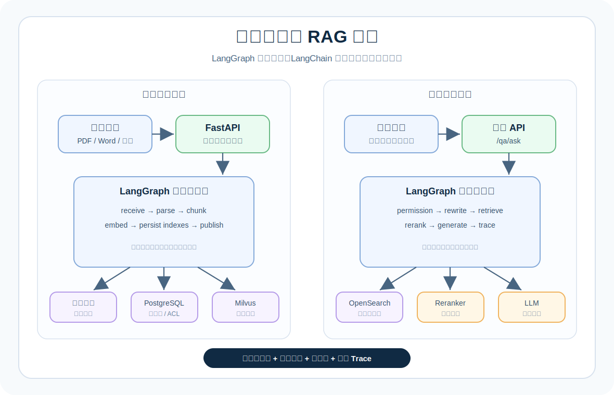
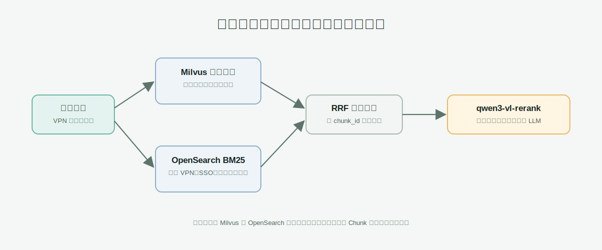
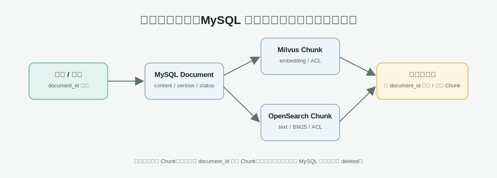

# 企业知识库 RAG 问答系统

[](https://www.python.org/)
[](https://fastapi.tiangolo.com/)
[](https://langchain-ai.github.io/langgraph/)
[](https://milvus.io/)
[](https://opensearch.org/)

> 面向企业知识库的可运行 RAG 基础项目：权限过滤、混合召回、重排拒答、引用溯源和文档生命周期，一条链路跑通。

这是一个偏生产架构的 RAG MVP，不是只有“切 Chunk + 调大模型”的 Demo。它把事实数据、向量索引、关键词索引、工作流状态和回答审计拆开，方便后续接入企业认证、对象存储、评测集和异步任务系统。



这张图先回答一个问题：一次知识库问答会经过哪些组件。应用层由 FastAPI 提供接口，LangGraph 负责把入库和问答拆成可追踪的节点；MySQL 保存事实数据，Milvus 和 OpenSearch 保存可以重新构建的检索索引。

## 为什么值得看

- **不绑定框架业务模型**：`Document`、`Chunk`、`Citation`、`AnswerTrace` 是项目自己的核心类型。
- **混合召回**：Milvus 负责语义相似，OpenSearch BM25 负责强关键词，RRF 合并后再 rerank。
- **先权限、后检索**：租户、知识空间和授权主体在每条召回路径中执行过滤。
- **不相关就拒答**：低于 Milvus 阈值或 rerank 阈值时，不调用生成模型，也不返回无关引用。
- **数据可追踪**：每次回答都能还原 query、Chunk、检索来源、模型和拒答原因。

## 已实现能力

- 中文工作台：知识录入、知识问答、文档管理。
- 文本与文件入库：手工文本、PDF、Word `.docx`、Markdown。
- 完整文档保存到 MySQL，Chunk 向量保存到 Milvus，关键词索引保存到 OpenSearch。
- Milvus 语义召回与 OpenSearch BM25 关键词召回并行执行。
- RRF 合并去重后调用百炼 `qwen3-vl-rerank` 重排。
- 低相关度直接拒答，不调用 LLM，也不返回无关引用。
- 每个回答返回 Citation 和 Trace，便于排查检索、重排与拒答原因。
- 文档可编辑和删除；同一 `document_id` 更新时替换对应 Chunk 索引。

## 30 秒运行

### 1. 准备依赖

需要本地运行 MySQL、Milvus 和 OpenSearch。完整安装说明见[快速启动](#快速启动)。

```bash
conda create -n rag python=3.11 -y
conda activate rag
pip install -e .
uvicorn app.main:app --reload
```

打开工作台：<http://127.0.0.1:8000/>

### 2. 入库一篇文本

```bash
curl -X POST http://127.0.0.1:8000/documents/ingest \
  -H 'Content-Type: application/json' \
  -d '{
    "title": "VPN 申请制度",
    "source_uri": "manual://vpn",
    "content": "VPN 账号申请需要直属主管审批。",
    "tenant_id": "t1",
    "space_id": "it",
    "allowed_subjects": ["user:bob"]
  }'
```

也可以直接在工作台上传 PDF、DOCX 或 Markdown 文件。第一版只提取原生文字层，不处理扫描件 OCR。

### 3. 发起一次问答

```bash
curl -X POST http://127.0.0.1:8000/qa/ask \
  -H 'Content-Type: application/json' \
  -d '{
    "query": "VPN 怎么申请？",
    "tenant_id": "t1",
    "space_id": "it",
    "user_subjects": ["user:bob"],
    "top_k": 8
  }'
```

返回结果包含 `answer`、`citations`、`confidence` 和 `trace`，可以直接用于前端展示和问题排查。

## 架构

### 三层存储

| 数据 | 当前存储 | 用途 |
| --- | --- | --- |
| 原始上传文件 | `data/uploads/` | 保留 PDF、DOCX、Markdown 原文件 |
| 完整 Document | MySQL `documents` | 正文、版本、状态、权限、元数据 |
| Chunk 向量 | Milvus `rag_chunks` | 语义检索、向量、ACL 过滤 |
| Chunk 文本索引 | OpenSearch `rag_chunks` | BM25 关键词检索、ACL 过滤 |

### 混合召回



这张图说明“为什么同时使用两种搜索”：Milvus 根据向量理解语义，OpenSearch 根据 BM25 匹配关键词。两条分支并行执行，结果按 `chunk_id` 去重，再用 RRF 合并排序，最后交给 rerank 做更精确的相关性判断。

```text
Milvus：擅长“意思相近”，例如“公司内网怎么开通”能找到 VPN 文档。
OpenSearch：擅长“关键词准确”，例如 VPN、SSO、OA、错误码、制度编号。
Rerank：判断某个 Chunk 是否真的能回答问题。
```

两条召回分支没有业务先后顺序：它们并行执行，按 `chunk_id` 去重，通过 RRF 融合排序后再重排。

BM25 可以理解为“带词频和稀有度权重的关键词搜索”：问题里出现的词越重要、在文档中匹配得越好，得分越高。它对 `VPN`、`SSO`、错误码、制度编号这类不能被改写或遗漏的强术语很有价值；向量检索则更适合处理同义表达和自然语言描述。

### 文档更新与删除



这张图说明同一份文档如何保持三套数据一致。`document_id` 是关联主键：更新时重新切 Chunk、生成向量并替换 Milvus/OpenSearch 中的旧索引；删除时清理两套 Chunk 索引，同时在 MySQL 中保留删除状态和审计信息。

```text
更新：保留 document_id -> version + 1 -> 新 Chunk 入库 -> 清理旧 Chunk
删除：Milvus + OpenSearch 清理对应 Chunk -> MySQL 状态标记为 deleted
```

MySQL 是完整文档的事实来源；Milvus 和 OpenSearch 都是可重建的检索索引。

### 图片与组件对照

| 图片 | 重点 | 对应代码 |
| --- | --- | --- |
| `docs/images/architecture.svg` | 系统分层与数据落点 | `app/main.py`、`app/workflows/` |
| `docs/images/hybrid-retrieval.svg` | 向量召回、BM25、RRF、rerank | `app/adapters/opensearch.py`、`app/adapters/milvus.py` |
| `docs/images/document-lifecycle.svg` | 文档新增、更新、删除 | `app/adapters/mysql.py`、`app/workflows/indexing.py` |

## 核心流程

### 入库

```text
文本 / PDF / DOCX / Markdown
-> 文字提取
-> LangGraph 索引工作流
-> 切分 Chunk
-> 百炼 text-embedding-v4
-> MySQL 保存 Document
-> Milvus 保存 Chunk + embedding
-> OpenSearch 保存 Chunk + BM25 字段
-> 发布 published 状态
```

第一版 PDF 仅提取文件本身的文字层：

```text
可复制文字的 PDF：支持
扫描版 PDF、图片里的文字：暂不支持 OCR，会明确拒绝入库
```

### 问答

```text
用户问题
-> 权限参数规范化
-> Query rewrite
-> Milvus 向量召回
-> OpenSearch BM25 召回
-> RRF 融合、去重
-> qwen3-vl-rerank
-> rerank 阈值判断
-> DeepSeek 生成答案或直接拒答
-> 返回 answer + citations + trace
```

当前拒答配置：

```text
混合召回中最高 Milvus 原始分数 < 0.2：直接拒答
rerank Top 1 分数 < 0.5：直接拒答
```

RRF 分数只用于融合排序，不与 `0.2` 阈值直接比较；混合召回会保留 Milvus 原始分数，供低相关度判断使用。最终是否调用生成模型，还要通过 rerank 阈值。

## 目录结构

```text
app/
  main.py                       FastAPI API 与依赖装配
  settings.py                   环境配置
  domain/models.py              Document、Chunk、ACL、Citation、Trace
  adapters/
    mysql.py                    MySQL Document 存储与组合存储
    milvus.py                   Milvus 向量写入、替换、删除、语义召回
    opensearch.py               OpenSearch BM25 写入、替换、删除、混合 RRF
    dashscope.py                百炼 embedding 适配器
    dashscope_reranker.py       百炼 rerank 适配器
    deepseek.py                 DeepSeek 生成模型适配器
  parsers/text.py               PDF、DOCX、Markdown 文字提取
  workflows/
    indexing.py                 LangGraph 文档入库图
    qa.py                       LangGraph 问答图与拒答分支
  static/index.html             左侧导航工作台
tests/                          单测、接口测试、解析与适配器测试
docs/images/                    README 架构图
```

## 快速启动

### 1. 创建 conda 环境

```bash
conda create -n rag python=3.11 -y
conda activate rag
```

### 2. 安装 Python 依赖

```bash
pip install \
  fastapi "uvicorn[standard]" langgraph langchain-core langchain-deepseek \
  pydantic pydantic-settings python-multipart httpx openai \
  pymilvus opensearch-py SQLAlchemy aiomysql greenlet \
  pymupdf python-docx \
  pytest pytest-asyncio ruff
```

### 3. 准备本地服务

```text
MySQL      127.0.0.1:3306
Milvus     127.0.0.1:19530
OpenSearch 127.0.0.1:9200
```

应用首次启动会自动创建：

```text
MySQL database：enterprise_rag
MySQL table：documents
Milvus collection：rag_chunks
OpenSearch index：rag_chunks
```

### 4. 配置 `.env`

`.env` 已被 Git 忽略，密钥和本地密码不会被提交。

```env
RAG_LLM_PROVIDER=deepseek
RAG_DEEPSEEK_API_BASE=https://api.deepseek.com
RAG_DEEPSEEK_API_KEY=你的 DeepSeek Key
RAG_DEEPSEEK_MODEL=deepseek-v4-flash

RAG_EMBEDDING_PROVIDER=dashscope
RAG_EMBEDDING_API_BASE=https://{WorkspaceId}.cn-beijing.maas.aliyuncs.com/compatible-mode/v1
RAG_EMBEDDING_API_KEY=你的百炼 Key
RAG_EMBEDDING_MODEL=text-embedding-v4
RAG_EMBEDDING_DIMENSIONS=1024
RAG_EMBEDDING_VERSION=text-embedding-v4-1024-v1

RAG_RERANKER_PROVIDER=dashscope
RAG_RERANKER_API_URL=https://{WorkspaceId}.cn-beijing.maas.aliyuncs.com/api/v1/services/rerank/text-rerank/text-rerank
RAG_RERANKER_API_KEY=你的百炼 Key
RAG_RERANKER_MODEL=qwen3-vl-rerank
RAG_MIN_RERANK_SCORE=0.5

RAG_MYSQL_HOST=127.0.0.1
RAG_MYSQL_PORT=3306
RAG_MYSQL_USERNAME=root
RAG_MYSQL_PASSWORD=你的 MySQL 密码
RAG_MYSQL_DATABASE=enterprise_rag

RAG_MILVUS_URI=http://localhost:19530
RAG_MILVUS_CHUNKS_COLLECTION=rag_chunks
RAG_MIN_RETRIEVAL_SCORE=0.2

RAG_OPENSEARCH_URL=http://127.0.0.1:9200
RAG_OPENSEARCH_INDEX=rag_chunks
RAG_HYBRID_CANDIDATE_TOP_K=20
RAG_HYBRID_RRF_K=60

RAG_UPLOAD_DIRECTORY=data/uploads
RAG_UPLOAD_MAX_BYTES=20971520
```

### 5. 启动

```bash
uvicorn app.main:app --reload
```

打开工作台：

```text
http://127.0.0.1:8000/
```

Swagger 仍可用于调试：

```text
http://127.0.0.1:8000/docs
```

## API

| 方法 | 路径 | 用途 |
| --- | --- | --- |
| `POST` | `/documents/ingest` | 手工文本入库 |
| `POST` | `/documents/upload` | 上传 PDF、DOCX、Markdown |
| `GET` | `/documents` | 按租户、空间查询文档列表 |
| `GET` | `/documents/{document_id}` | 读取完整 Document |
| `PUT` | `/documents/{document_id}` | 更新 Document 并替换 Chunk 索引 |
| `DELETE` | `/documents/{document_id}` | 清理 Chunk 索引并标记删除 |
| `POST` | `/qa/ask` | 发起带引用的知识库问答 |
| `GET` | `/health` | 健康检查 |

## 本地验证

```bash
conda run -n rag pytest
conda run -n rag ruff check .
```

当前验证覆盖：

- LangGraph 入库、权限过滤、拒答与 Trace。
- FastAPI 文档新增、列表、详情、更新、删除、上传。
- DashScope embedding 与 rerank 请求格式。
- Milvus Chunk 写入、替换、删除与 ACL 过滤。
- OpenSearch BM25 过滤与 RRF 融合。
- PDF、DOCX、Markdown 文字提取与扫描版 PDF 拒绝。

## 当前限制与下一步

- 前端传入 `user_subjects`，尚未接 JWT / SSO，不能视为最终生产安全方案。
- PDF 暂不 OCR；扫描件和图片文字需要后续接 PaddleOCR、云 OCR 或本地视觉模型。
- OpenSearch 刚接入时，历史数据不会自动拥有关键词索引；开发环境可重新上传，生产环境应提供后台全量重建任务。
- 当前 rerank 使用 `qwen3-vl-rerank`；应使用企业评测集对比纯文本 `qwen3-rerank` 并校准阈值。
- 原始上传文件当前保存在本地目录；生产环境应迁移到 MinIO/S3。

## 生产化路线

```text
当前 MVP
  -> JWT / SSO 与服务端 ACL
  -> MinIO / S3 原始文件存储
  -> Celery / Redis 或消息队列异步索引
  -> OpenSearch 中文分词与同义词配置
  -> 企业评测集、Recall@K、MRR、nDCG、拒答率
  -> LangGraph 状态持久化、失败重试和人工审核
  -> Prometheus / OpenTelemetry 监控与告警
```

欢迎通过 Issue 或 Pull Request 分享评测数据、模型适配器和生产实践。

## 设计原则

- 核心业务模型归项目自己所有，不被框架类型绑定。
- 权限过滤必须发生在每一条召回路径上。
- 没有可靠依据就拒答，不让 LLM 为不相关 Chunk 编造引用。
- MySQL 保存事实数据，Milvus 与 OpenSearch 保存可重建索引。
- 每次回答都能追踪 query、候选 Chunk、模型、引用与拒答原因。
